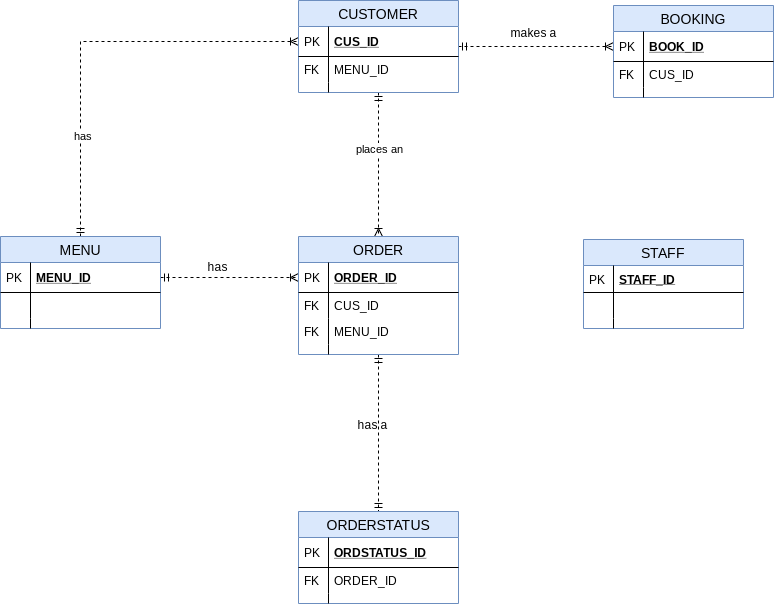
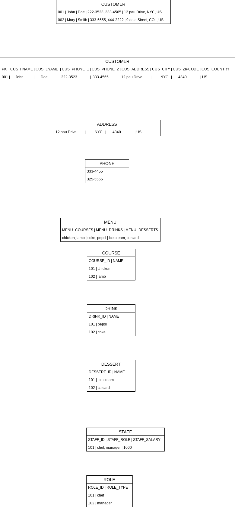

# Design Models

## Conceptual Model

## Logical Model

ENTITIES AND ATTRIBUTES:

    - BOOKING : BOOKING_ID, DATE, TABLE_NO

    - ORDER : ORDER_ID, ORDER_DATE, QUANTITY, TOTAL_COST

    - ORDERSTATUS : ORD_STATUS_ID, DATE

    - MENU : MENU_ID, MENU_COURSES, MENU_DRINKS, MENU_DESSERTS

    - CUSTOMER : CUS_ID, CUS_FNAME, CUS_LNAME, CUS_PHONENUMBER, CUS_ADDRESS

    - STAFF : STAFF_ID, STAFF_ROLE, STAFF_SALARY 

## Normalization

#### Sample Data

Revised Entities:
 
    - CUSTOMER : CUS_ID, CUS_FNAME, CUS_LNAME
    
    - ADDRESS : ADDR_STREET, ADDR_CITY, ADDR_ZIPCODE, ADDR_COUNTRY

    - CONTACT : CONT_NUMBER

    - MENU : MENU_ID, MENU_NAME

    - COURSE : COURSE_ID, COURSE_NAME

    - DRINK : DRINK_ID, DRINK_NAME

    - DESSERT : DESSERT_ID, DESSERT_NAME

    - STAFF : STAFF_ID, STAFF_SALARY

    - ROLE : ROLE_ID, ROLE_TYPE

## VERIFIED LOGICAL MODEL

