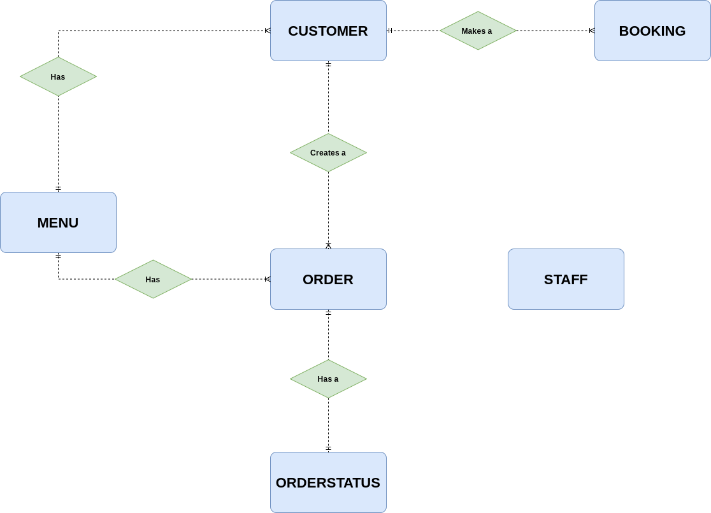

# Initial Study Little Lemon

Little Lemon needs to build a robust relational database system in MySQL in which they can store large amounts of data. They then need to easily manage and find this data as required. This database system should maintain information about the following aspects of the business:

Conceptual and Real world things in Little Lemon:

    - Bookings

    - Orders

    - Order Delivery status

    - Menu

    - Customer details

    - and Staff Information

#### Anaylsis Model

